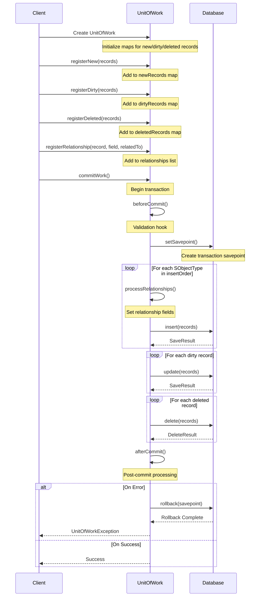

# Unit-of-Work

This project demonstrates the implementation of the Unit of Work pattern, providing a robust way to manage database transactions and operations.

## Motivation

The Unit of Work pattern was popularized by the excellent [Apex Commons](https://github.com/apex-enterprise-patterns/fflib-apex-common/blob/master/sfdx-source/apex-common/main/classes/fflib_SObjectUnitOfWork.cls).

While powerful, Apex Commons can sometimes be cumbersome to use in smaller projects, projects with significant legacy code, or projects that are simply incompatible with `fflib`'s idioms.

This implementation provides a lightweight alternative with zero dependencies, making it easier to:

- Introduce additional safety (e.g. validation, rollback) to DML operations
- Share transactions across multiple services
- Handle complex relationships between records
- Keep your code type-safe and maintainable

## 🔄 Unit of Work Pattern Flow



## 📁 Project Structure

```
📁 unit-of-work/
 ├── 📁 orgs/                  # Scratch org configurations
 ├── 📁 force-app/          
 │   └── 📁 main/default/      # Main source code directory
 ├── 📁 unpackaged/examples    # A few basic usage patterns 
 └── 📄 cumulusci.yml          # Nuts and bolts
```

## 📖 Usage Patterns

### Basic Usage
```java
// Create a new UnitOfWork instance
UnitOfWork uow = new UnitOfWork();

// Stage some new records
Account acc = new Account(Name = 'Test Account');
Contact con = new Contact(LastName = 'Test Contact', Email = 'test@example.com');

// Register the records to uow
uow.registerNew(acc);
uow.registerNew(con);

// ... maybe throw in some relationships
uow.registerRelationship(con, Contact.AccountId, acc);

// Commit all changes
uow.commitWork();
```

### Complex Relationships with Junction Objects
```java
UnitOfWork uow = new UnitOfWork();

// Create parent records
Account acc = new Account(Name = 'Test Account');
Contact con = new Contact(LastName = 'Test Contact');
Opportunity opp = new Opportunity(
    Name = 'Test Opp',
    StageName = 'Prospecting',
    CloseDate = Date.today().addDays(30)
);

// Register all records
uow.registerNew(acc);
uow.registerNew(con);
uow.registerNew(opp);

// Set up direct relationships
uow.registerRelationship(con, Contact.AccountId, acc);
uow.registerRelationship(opp, Opportunity.AccountId, acc);

// Create junction record (e.g., OpportunityContactRole)
uow.registerJunction(
    OpportunityContactRole.SObjectType,
    OpportunityContactRole.ContactId,
    OpportunityContactRole.OpportunityId,
    con,
    opp
);

uow.commitWork();
```

### Nested Transactions
```java
// Root transaction
UnitOfWork root = new UnitOfWork();
root.allowPartialSuccess(); // Optional: allow partial success

Account acc = new Account(Name = 'Parent Account');
root.registerNew(acc);

// Nested transaction
UnitOfWork nested = new UnitOfWork();
Contact con = new Contact(LastName = 'Nested Contact');
nested.registerNew(con);
nested.registerRelationship(con, Contact.AccountId, acc);
nested.commitWork();

// Root transaction continues
root.commitWork();
```

## ⚠️ Error Handling

The `UnitOfWorkException` is a special exception class that provides detailed error information through an exception tree structure. This is particularly useful when multiple errors occur during a transaction.

Key features of the `UnitOfWorkException`:
1. **Exception Tree**: Maintains a hierarchical structure of errors
2. **Detailed Context**: Each error includes the operation type and affected record
3. **Transaction Safety**: All errors are captured before rollback
4. **Debug Support**: Includes a handful of specialized logging utilities for detailed error inspection

### Exception Tree Structure
```java
try {
    UnitOfWork uow = new UnitOfWork();
    // ... register operations ...
    uow.commitWork();
} catch (UnitOfWork.UnitOfWorkException e) {
    // The exception can contain multiple nested errors
    System.debug(LoggingLevel.ERROR, e.getExceptionTree());
    
    // Example output:
    // === UnitOfWork Exception Tree ===
    // Root Error: Multiple errors occurred during transaction
    //   - Failed to insert Account: Required fields are missing
    //   - Failed to update Contact: Invalid email format
    // ===============================
}
```

### JSON Serialization
The `UnitOfWorkException` sports a handy `toJSON()` method to make it easier to process exceptions programmatically (especially if you ship your logs to an external system):

```java
try {
    UnitOfWork uow = new UnitOfWork();
    // ... register operations ...
    uow.commitWork();
} catch (UnitOfWork.UnitOfWorkException e) {
    // Convert exception tree to JSON
    String jsonError = e.toJson();
}
```

This produces a clean, nested array structure:
```json
[
  "Multiple errors occurred during transaction",
  [
    [
      "Failed to insert Account records",
      [
        ["Record 0: Required fields are missing: [Name]"],
        ["Record 1: Invalid email address: test@invalid"]
      ]
    ],
    [
      "Failed to insert Contact records",
      [
        ["Record 0: Please enter either a Phone number or an Email address"],
        ["Record 1: Parent Account was not inserted"]
      ]
    ]
  ]
]
```

If you need stack traces in your JSON output, you can include them like this:
```java
try {
    UnitOfWork uow = new UnitOfWork();
    // ... register operations ...
    uow.commitWork();
} catch (UnitOfWork.UnitOfWorkException e) {
    // Include stack trace in the JSON output
    Map<String, Object> errorWithStack = new Map<String, Object>{
        'message' => e.getMessage(),
        'stackTrace' => e.getStackTraceString(),
        'tree' => JSON.deserializeUntyped(e.toJson())
    };
    String jsonWithStack = JSON.serialize(errorWithStack);
}
```

Which produces:
```json
{
  "message": "Multiple errors occurred during transaction",
  "stackTrace": "Class.UnitOfWork.doWork: line 123, column 1\nClass.UnitOfWork.commitWork: line 45, column 1",
  "tree": [
    "Multiple errors occurred during transaction",
    [
      [
        "Failed to insert Account records",
        [
          ["Record 0: Required fields are missing: [Name]"],
          ["Record 1: Invalid email address: test@invalid"]
        ]
      ],
      [
        "Failed to insert Contact records",
        [
          ["Record 0: Please enter either a Phone number or an Email address"],
          ["Record 1: Parent Account was not inserted"]
        ]
      ]
    ]
  ]
}
```

## 🏗️ Development Setup

1. [Set up CumulusCI](https://cumulusci.readthedocs.io/en/latest/tutorial.html)
2. Clone the repository:
   ```bash
   git clone [repository-url]
   cd unit-of-work
   ```

## 🤝 Contributing

1. Create a feature branch from `main`:
   ```bash
   git checkout -b feature/your-feature-name
   ```

2. Make your changes and commit them
3. Push to your feature branch
4. Create a Pull Request

---
<div align="center">
Made with ❤️ by Nimba
</div>
