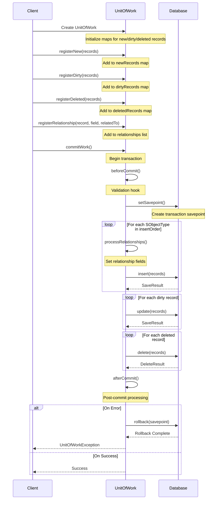

# Unit-of-Work

A Salesforce project that demonstrates the implementation of the Unit of Work pattern, providing a robust way to manage database transactions and operations. This project includes both API and UI-based implementations for managing Contact records, along with comprehensive test coverage.

## 🔄 Unit of Work Pattern Flow



## 📖 Usage Patterns

### Basic Usage
```java
// Create a new UnitOfWork instance
UnitOfWork uow = new UnitOfWork();

// Register new records
Account acc = new Account(Name = 'Test Account');
Contact con = new Contact(LastName = 'Test Contact', Email = 'test@example.com');

// Register the records
uow.registerNew(acc);
uow.registerNew(con);

// Set up relationships
uow.registerRelationship(con, Contact.AccountId, acc);

// Commit all changes
uow.commitWork();
```

### Complex Relationships with Junction Objects
```java
UnitOfWork uow = new UnitOfWork();

// Create parent records
Account acc = new Account(Name = 'Test Account');
Contact con = new Contact(LastName = 'Test Contact');
Opportunity opp = new Opportunity(
    Name = 'Test Opp',
    StageName = 'Prospecting',
    CloseDate = Date.today().addDays(30)
);

// Register all records
uow.registerNew(acc);
uow.registerNew(con);
uow.registerNew(opp);

// Set up direct relationships
uow.registerRelationship(con, Contact.AccountId, acc);
uow.registerRelationship(opp, Opportunity.AccountId, acc);

// Create junction record (e.g., OpportunityContactRole)
uow.registerJunction(
    OpportunityContactRole.SObjectType,
    OpportunityContactRole.ContactId,
    OpportunityContactRole.OpportunityId,
    con,
    opp
);

uow.commitWork();
```

### Nested Transactions
```java
// Root transaction
UnitOfWork root = new UnitOfWork();
root.allowPartialSuccess(); // Optional: allow partial success

Account acc = new Account(Name = 'Parent Account');
root.registerNew(acc);

// Nested transaction
UnitOfWork nested = new UnitOfWork();
Contact con = new Contact(LastName = 'Nested Contact');
nested.registerNew(con);
nested.registerRelationship(con, Contact.AccountId, acc);
nested.commitWork();

// Root transaction continues
root.commitWork();
```

## ⚠️ Error Handling

The `UnitOfWorkException` is a special exception class that provides detailed error information through an exception tree structure. This is particularly useful when multiple errors occur during a transaction.

### Exception Tree Structure
```java
try {
    UnitOfWork uow = new UnitOfWork();
    // ... register operations ...
    uow.commitWork();
} catch (UnitOfWork.UnitOfWorkException e) {
    // The exception can contain multiple nested errors
    System.debug(LoggingLevel.ERROR, e.getExceptionTree());
    
    // Example output:
    // === UnitOfWork Exception Tree ===
    // Root Error: Multiple errors occurred during transaction
    //   - Failed to insert Account: Required fields are missing
    //   - Failed to update Contact: Invalid email format
    // ===============================
}
```

### JSON Serialization
The `UnitOfWorkException` sports a handy toJSON() method to make it easier to work with programmatically (especially if you ship your logs to an external system):

#### For example, the following code block...
```java
try {
    UnitOfWork uow = new UnitOfWork();
    // ... register operations ...
    uow.commitWork();
} catch (UnitOfWork.UnitOfWorkException e) {
    // Convert exception tree to JSON
    String jsonError = e.toJson();
}
```
... might produce something like this...
```json
[
  "Multiple errors occurred during transaction",
  [
    [
      "Failed to insert Account records",
      [
        ["Record 0: Required fields are missing: [Name]"],
        ["Record 1: Invalid email address: test@invalid"]
      ]
    ],
    [
      "Failed to insert Contact records",
      [
        ["Record 0: Please enter either a Phone number or an Email address"],
        ["Record 1: Parent Account was not inserted"]
      ]
    ]
  ]
]
```

Key features of the UnitOfWorkException:
1. **Exception Tree**: Maintains a hierarchical structure of errors
2. **Detailed Context**: Each error includes the operation type and affected record
3. **Transaction Safety**: All errors are captured before rollback
4. **Debug Support**: Includes logging utilities for detailed error inspection
5. **JSON Support**: Provides structured JSON output for external integration
6. **Tree Visualization**: Includes ASCII tree visualization for debugging

## 🚀 Features

- ⚡ Implementation of the Unit of Work pattern for Salesforce
- 👥 Contact management functionality
- 🤖 Automated testing using Robot Framework
- 🔄 Both API and UI-based operations
- ✅ Comprehensive test coverage (75% minimum required)

## 📁 Project Structure

```
unit-of-work/
├── force-app/          # Salesforce source code
│   └── main/default/   # Main source code directory
├── robot/             # Robot Framework test automation
│   └── Unit-of-Work/  # Test suites and resources
├── datasets/          # Test data sets
├── orgs/              # Scratch org configurations
└── category/          # Project categorization
```

## 🛠️ Prerequisites

- [Salesforce CLI](https://developer.salesforce.com/tools/sfdx_cli)
- [CumulusCI](https://cumulusci.readthedocs.io/) (version 3.78.0 or higher)
- Python 3.x
- Git

## 🏗️ Development Setup

1. Clone the repository:
   ```bash
   git clone [repository-url]
   cd unit-of-work
   ```

2. Set up CumulusCI:
   - Follow the [CumulusCI setup guide](https://cumulusci.readthedocs.io/en/latest/tutorial.html)
   - Ensure you have the required dependencies installed

3. Create and configure a scratch org:
   ```bash
   cci flow run dev_org --org dev
   ```

4. Open the org in your browser:
   ```bash
   cci org browser dev
   ```

## 🧪 Testing

The project includes Robot Framework tests for both API and UI operations. To run the tests:

```bash
# Run all tests
cci robot run

# Generate test documentation
cci robot testdoc
```

## 🤝 Contributing

1. Create a feature branch from `main`:
   ```bash
   git checkout -b feature/your-feature-name
   ```

2. Make your changes and commit them
3. Push to your feature branch
4. Create a Pull Request

## 📝 License

[Add your license information here]

## 💬 Support

[Add support information here]

---
<div align="center">
Made with ❤️ by [Your Name/Team]
</div>